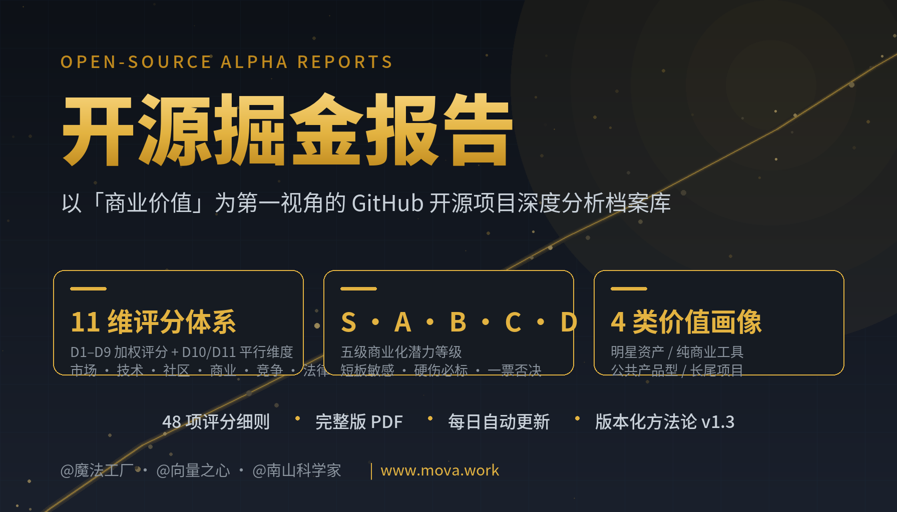
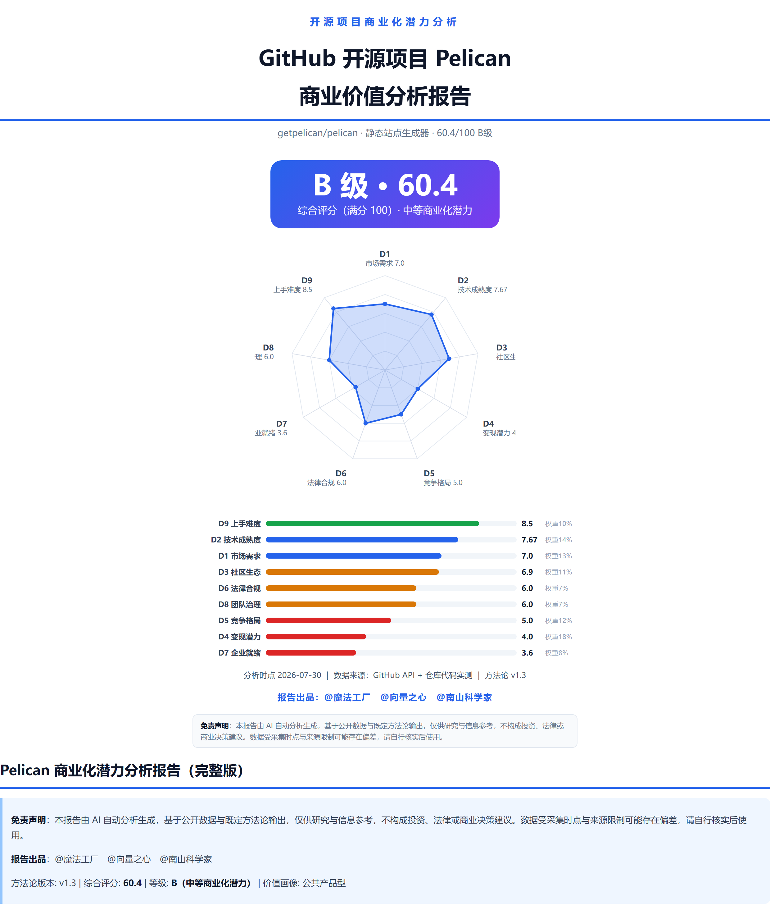

<div align="center">

# Open-Source Alpha Reports

**开源掘金报告 · 以「商业价值」为第一视角的 GitHub 开源项目深度分析档案库**

[]()
[](https://github.com/weixiongf/Open-Source-Alpha-Reports/stargazers)
[](https://github.com/weixiongf/Open-Source-Alpha-Reports/commits)
[]()
[]()
[](https://creativecommons.org/licenses/by-nc-nd/4.0/)

*Reports are written in Chinese · 报告均为中文撰写*

> **别人在 GitHub 上刷 Star，我们在 GitHub 上掘金。**
>
> 每一份 PDF，都是一次完整的「商业尽调」：11 个维度、48 项评分细则、一条可执行的商业化路径判断。

</div>

<div align="center">
  
</div>

## 目录

[这个仓库是什么](#what) · [为什么说它「含金量」十足](#why-gold) · [每份报告包含什么](#inside) · [我们怎么分析：方法论要点](#methodology) · [报告长什么样](#sample) · [报告清单](#list-index) · [适合谁看](#audience) · [如何使用](#usage) · [常见问题](#faq)

---

<a id="what"></a>
## 这个仓库是什么

这是一个**每日自动更新**的开源项目商业价值分析报告库。我们针对热门 GitHub 开源项目，基于统一方法论（版本化管理，当前 v1.3）进行量化拆解与深度分析，产出**完整版 PDF 报告**，并全自动推送到本仓库。

> **一句话定位：以「商业价值」为第一视角的开源项目深度分析。**
>
> 我们不写代码解读，不做安全审计，也不空谈情怀——每一份报告的核心命题只有一个：**这个开源项目，商业上值不值得投入？** 市场机会、商业模式、变现潜力、竞争壁垒，全部围绕商业价值展开；技术、社区、法律等维度，也是作为「商业价值的支撑与风险」来评估的。

不吹不黑，数据说话。AI 驱动，持续产出。

<a id="why-gold"></a>
## 为什么说它「含金量」十足

### 01 | 全网稀缺的「中文版开源商业尽调」

网上有数不清的源码解读与技术笔记，却几乎找不到一份系统回答「这个项目值不值得投入、能不能商业化」的深度报告。我们把每个开源项目当成一家公司来尽调：市场、技术、社区、商业、竞争、法律、治理、易用性，一个不落。

### 02 | 一套尺子，横向对比

方法论版本化管理，所有报告共用同一套 11 维评分体系。同分可比、同维可查——选型对比、赛道调研、学习路线规划，一个报告库全搞定。

### 03 | 10 分钟，省下 40 小时

不用 clone 代码、不用翻 issue、不用整理市场数据。打开一份 PDF，评分、亮点、硬伤、路径、风险一览无余。

### 04 | 敢说硬话，客观中立

报告由 AI 基于 GitHub 公开数据与既定方法论自动生成，没有软文滤镜。「两大硬伤」「核心风险」照写不误——商业分低就是低，路被堵死就说堵死。

### 05 | 活体仓库，持续进化

全自动流水线：数据采集 → 11 维 AI 分析 → 综合评分与价值画像 → PDF 生成 → 推送本仓库。Star 一次，长期订阅，每天都有新弹药。

---

<a id="inside"></a>
## 每份报告包含什么

**十一维评分体系**

| 维度 | 权重 | 维度 | 权重 |
|---|---|---|---|
| D1 市场需求与商业机会 | 13% | D6 法律合规与知识产权 | 7% |
| D2 技术成熟度与产品质量 | 14% | D7 企业就绪度与可运营性 | 8% |
| D3 社区健康度与生态势能 | 11% | D8 团队治理与可持续性 | 7% |
| D4 商业模式与变现潜力 | 18% | D9 上手难度与易用性 | 10% |
| D5 竞争格局与差异化壁垒 | 12% | D10 功能价值 / D11 社会价值 | 平行维度 |

**核心产出**

- 综合评分（百分制）+ 商业化等级（S / A / B / C / D）
- 价值画像：明星资产 / 纯商业工具 / 公共产品型 / 长尾项目
- 每维度细则评分 + 数据依据
- 三大亮点 + 两大硬伤
- 推荐商业路径（含可行性评估）+ 不推荐路径
- 核心风险清单（法律合规 / 可持续性 / 竞争格局）
- 安装部署速览（部分报告）

<a id="methodology"></a>
## 我们怎么分析：方法论要点

报告不是「感觉流」。每一份都跑同一套版本化管理的方法论（当前 v1.3），几个关键设计：

### 三种价值，分开打分

- **商业价值（D1–D9）**：回答「有人愿意为它付钱吗」——加权汇入百分制综合评分
- **功能价值（D10）**：回答「用它的人省了多少、赚了多少，不论付不付钱」
- **社会价值（D11）**：回答「它给没在用的人与整个行业带来了什么」

三者正交，互不污染：一个「好用但赚不到钱」的项目，不会因为功能价值高而被美化商业分；一个「赚钱但无外部性」的项目，也不会被情怀滤镜拉低评分。

### 短板敏感，硬伤必标

- 任一商业维度 ≤ 4 分即标记为「商业化硬伤」，必须在报告中点名——这就是「两大硬伤」章节的由来
- 触发一票否决的项目，等级直接判 D，不搞平均分遮丑

### 同一把尺子，时点快照

- 六档评分粒度 + N/A 规则，所有项目用同一标尺，可横向对比
- 每份报告注明数据采集时点，反映的是那一刻的真实状态，不是过期滤镜

### 评分之外，还看画像

- 商业分 × 公共价值分构成四象限，判定价值画像：明星资产 / 纯商业工具 / 公共产品型 / 长尾项目
- 画像直接修正商业路径建议——「赚钱的路径」和「值钱的方向」分开说

<a id="sample"></a>
## 报告长什么样

以《Pelican 商业价值分析报告（完整版）》为例：

<div align="center">
  
</div>

> 综合评分 60.4 | B 级 | 价值画像：公共产品型
> D9 易用性 8.5/10 一枝独秀，D4 商业模式 4.0/10 裸奔垫底
> 推荐路径：影响力变现；不推荐路径：立即推出企业版

10 分钟，看懂一个项目的全部家底。

<a id="list-index"></a>
## 报告清单

每份报告发布后同步登记到 [list/](list/) 目录的月度清单（序号 / 项目 / 综合得分 / 等级 / 一句话结论），方便快速检索与横向对比。首期已收录：

| 项目 | 综合得分 | 等级 | 一句话结论 |
|---|---|---|---|
| [gin-gonic/gin](https://github.com/gin-gonic/gin) | 76.8 | A | 流量金矿：框架本身不能收费，但 9 万 Star 开发者入口足以撑起一个 Go 生态商业平台 |
| [getpelican/pelican](https://github.com/getpelican/pelican) | 60.4 | B | 技术成熟、易用性极佳，但商业模式空白，适合走影响力变现路线 |
| [lupantech/AgentFlow](https://github.com/lupantech/AgentFlow) | 49.1 | C | 项目身份混乱、商业化基础为零——连「名不副实」我们也照写，不建议投入 |

完整报告见 `reports/` 目录（按日期归档），全部历史清单见 `list/` 目录。

<a id="audience"></a>
## 适合谁看

| 角色 | 能从这里得到什么 |
|---|---|
| 开发者 | 一眼看清项目的架构、社区成色与上手难度，找到值得学习 / 参与的项目 |
| 技术负责人 / CTO | 选型前的量化依据，避免「拍脑袋引入、哭着重构」 |
| 创业者 / 独立开发者 | 发现被低估的开源项目，找到可复制的商业化路径 |
| 投资人 / 行业分析师 | 开源赛道的尽调参考资料与横向对比标尺 |
| 技术内容创作者 | 现成的选题库、数据源与观点弹药 |

---

<details>
<summary><b>目录结构</b></summary>

```
reports/
├── README.md                # 报告索引（自动生成，按日期倒序）
└── YYYY/MM/DD/
    └── <项目名>/
        ├── ..._完整版.pdf   # 完整版深度报告 PDF（核心交付物）
        ├── ..._完整版.md    # 同内容 Markdown 源文件
        └── ...              # 幻灯片 / 演示视频等衍生内容
```

报告按日期归档，随时回看任意项目在任意时点的分析快照。

</details>

<a id="usage"></a>
## 如何使用

1. 点击右上角 **Star**，持续接收更新
2. 进入 `reports/` 按日期浏览 PDF，或先看自动生成的索引
3. 点击 **Watch** 关注本仓库，第一时间收到新报告推送通知
4. 想看某个项目的分析？在 [Issues](https://github.com/weixiongf/Open-Source-Alpha-Reports/issues) 中留言，我们按热度排队

<a id="faq"></a>
## 常见问题

**报告收费吗？**
完全免费。所有 PDF 均可直接下载阅读——我们靠 Star 与关注续命。

**多久更新一份？**
流水线每日自动运行，产出即推送。更新频率取决于当日分析队列；Star 越多，挖矿越快。

**能保证客观吗？**
报告由 AI 基于 GitHub 公开数据与版本化方法论生成，头尾均附免责声明，「硬伤」与「风险」照写不误。发现错误，欢迎提 Issue 指正。

**报告和项目现状对不上，正常吗？**
正常。每份报告都是「时点快照」：只反映分析时点的真实状态，报告首部均标注分析时点。之后项目代码、功能、社区、协议可能发生变化，与旧报告不一致是常态——请以报告标注的分析时点为准。

## 免责声明

本仓库所有报告均由 AI 基于公开数据自动生成，仅供研究与信息参考，不构成投资、法律或商业决策建议。数据受采集时点与来源限制可能存在偏差，请自行核实后使用。

每份报告仅为**分析时点的状态快照**：此后项目在代码、功能、社区、协议等方面的任何变化，均不与该报告结论构成对应关系，请以报告标注的分析时点为准。

## 关于我们

**报告出品**：@魔法工厂 · @向量之心 · @南山科学家

**官方网站**：[www.mova.work](https://www.mova.work)

---

<div align="center">

**如果这些报告帮你省下过哪怕一个小时的调研时间，请给我们一颗 Star。**

**Star 是我们持续挖掘开源金矿的唯一燃料。**

**想看哪个项目的专业商业分析报告？欢迎[提交 Issue](https://github.com/weixiongf/Open-Source-Alpha-Reports/issues)，热门项目优先安排。**

</div>

## License

报告内容采用 [CC BY-NC-ND 4.0](https://creativecommons.org/licenses/by-nc-nd/4.0/) 许可：欢迎转载分享（保留署名），禁止商用与演绎修改。
